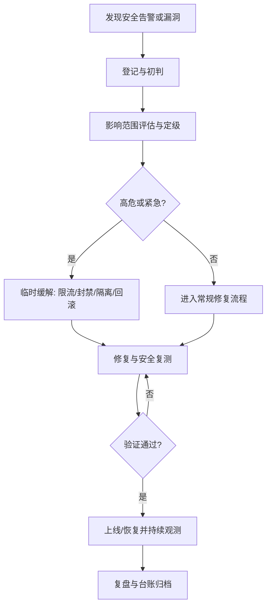

# GovCMS 信创适配、国密与交付要求

## 1. 正式交付目标

GovCMS 的正式交付标准不仅是功能可用，还必须满足信创适配和国密安全要求。

正式交付物包含：

- 后端源码
- 后台前端源码
- 门户模板与发布相关源码
- 数据库脚本
- 环境配置模板
- 部署脚本
- 运维手册
- 回滚手册
- 测试报告与验收文档

## 2. 信创适配基线

### 2.1 目标环境

- 数据库：`KingbaseES`
- 应用服务器：`TongWeb`
- Web 服务器：`Nginx`
- 操作系统：国产 OS 兼容（如麒麟、UOS）
- 云环境：政务云兼容部署方案

### 2.2 设计要求

- 数据访问层必须按 KingbaseES 兼容设计
- 应用打包与部署必须考虑 TongWeb 运行方式
- 配置模板必须覆盖开发、测试、生产、信创生产四类环境
- 部署文档必须描述环境搭建、部署、发布、回滚、故障排查流程

### 2.3 实施要求

- 本地开发可以保留便捷运行方式
- 正式环境必须以信创目标环境为验收标准
- 不允许只验证本地 MySQL 与本地 Spring Boot 运行后就宣称可正式交付

## 3. 全链路国密要求

### 3.1 传输安全

- 生产环境门户与后台访问必须支持国密 TLS/HTTPS
- 对外接口和门户动态接口必须支持国密证书体系

### 3.2 令牌与签名

- 登录令牌签名必须纳入国密签名体系
- 关键接口需要支持签名验签能力
- 发布回调、发布通知、关键运维操作记录需支持签名校验

### 3.3 敏感数据保护

- 敏感配置项必须采用加密存储
- 关键业务敏感字段应采用国密对称加密方案保护
- 密钥、证书、加密配置必须独立于普通业务配置维护

### 3.4 文件与发布产物

- 发布包、备份包、关键导出文件要支持摘要与验签
- 门户静态产物至少要具备完整性校验能力

### 3.5 密钥管理

- 区分开发、测试、生产环境密钥
- 定义密钥轮换、吊销、更新和应急替换流程
- 密钥材料不得与普通配置混放或写死在仓库默认值中

## 4. 门户网站 7*24 小时安全防护

### 4.1 目标

- 门户站点具备 `7*24` 持续监测与告警能力
- 对异常流量、攻击行为、篡改风险具备快速发现与快速处置能力
- 保障突发安全事件下可限流、可隔离、可回滚、可恢复

### 4.2 防护要求

- 边界防护：WAF、抗 DDoS、访问控制、恶意请求拦截
- 主机防护：基线加固、恶意文件查杀、异常进程与异常登录监测
- 应用防护：鉴权、限流、审计、输入校验；上传与表单重点防护
- 内容防护：静态产物、模板文件、发布包的完整性校验与留痕
- 监测告警：统一采集访问日志、WAF 日志、应用日志、系统日志并告警

### 4.3 运行机制

- 建立值班与告警响应机制，告警统一进入值班通道
- 高风险事件优先执行限流、封禁、隔离、切换与回滚，确保风险先受控
- 每周漏洞扫描与基线复核，每月应急演练并固化复盘结论

## 5. 安全漏洞与风险处理

### 5.1 原则

- 漏洞来源：安全扫描、日志告警、第三方通报、代码审计与人工巡检
- 处置顺序：定级评估 -> 临时缓解 -> 修复上线 -> 复测验证 -> 复盘归档
- 高危漏洞先缓解再修复，避免风险长时间暴露

### 5.2 时效要求

- 紧急/高危：立即响应，优先采取临时缓解措施并快速修复复测
- 高风险：24 小时内形成修复方案与上线计划并跟踪落地
- 中低风险：纳入最近一个修复周期闭环处理并复测确认

### 5.3 处置流程图

## 6. 当前代码差距

当前仓库与正式交付口径的主要差距如下：

- 当前默认数据库仍是 `MySQL`
- 当前默认运行方式仍是本地 `spring-boot:run`
- 当前认证仍是普通 JWT 签名链路
- 当前没有国密签名、验签、加解密服务抽象
- 当前没有 TongWeb 部署包和配置说明
- 当前没有 KingbaseES 兼容矩阵和迁移说明

## 7. 首期交付验收

### 7.1 功能验收

- 后台标准版流程闭环可用
- 门户标准版静态化发布可用

### 7.2 信创验收

- KingbaseES 兼容验证通过
- TongWeb 部署验证通过
- 国产 OS 环境运行验证通过
- Nginx 门户静态发布验证通过

### 7.3 国密验收

- 国密 TLS/HTTPS 可用
- 国密签名与验签链路可用
- 敏感数据加密链路可用
- 发布产物摘要校验与验签可用

### 7.4 交付验收

- 源码、脚本、配置、手册齐全
- 可以按照文档独立部署后台与门户
- 可以按照文档执行发布和回滚
