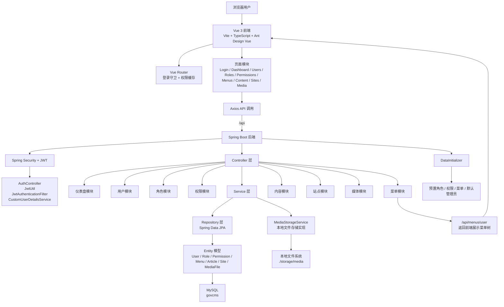

# Findings: GovCMS 当前实现研究

## 项目定位

当前仓库是一个 **前后端分离的 GovCMS 管理系统原型**，并非 Drupal / PHP 版 govCMS。

截至 **2026-03-10**，项目已经具备一套可运行、可演示、可自测的 MVP 后台能力，重点落在认证、RBAC、后台导航、内容管理、站点管理与媒体管理。

---

## 当前实际技术栈

### 后端
| 技术 | 当前实现 | 说明 |
|------|----------|------|
| 框架 | Spring Boot 3.2 | 主应用框架 |
| 语言 | Java 17 | 运行时版本 |
| 安全 | Spring Security + JWT | 登录认证与接口鉴权 |
| ORM | Spring Data JPA | 当前代码已落地 |
| 数据库 | MySQL | 默认库名 `govcms` |
| 构建 | Maven | 已通过本地 Maven 路径验证 |
| 文件存储 | 本地文件系统 | 默认目录 `./storage/media` |

### 前端
| 技术 | 当前实现 | 说明 |
|------|----------|------|
| 框架 | Vue 3 | 组合式 API |
| 语言 | TypeScript | 前端类型系统 |
| UI | Ant Design Vue | 后台管理界面组件库 |
| 路由 | Vue Router | 页面导航与登录守卫 |
| 请求 | Axios | 调用后端 API |
| 构建 | Vite | 本地开发与打包 |

---

## 当前已实现能力

### 核心业务模块
- 认证登录：`/api/auth/login`
- 用户管理：用户列表、详情、增删改、改密、重置密码
- 角色管理：角色 CRUD 与权限分配
- 权限管理：权限树与权限 CRUD
- 菜单管理：菜单 CRUD 与前端动态导航
- 仪表盘：基础统计接口与页面
- 内容管理：文章 CRUD、发布、下线
- 站点管理：列表、筛选、新增、编辑、删除、启停
- 媒体管理：上传、列表、筛选、打开 / 预览、删除

### 工程能力
- JWT 鉴权链路
- 路由守卫与 Token / 权限本地持久化
- 按钮级权限控制
- Vite 开发代理到后端 `8080`
- 初始化权限、角色、菜单、默认管理员
- 媒体存储抽象与本地文件系统实现
- 全局异常处理（含 `403` 权限错误返回、上传大小限制返回）
- `local` / `test` 双 Profile 配置

### 当前未实现模块
- 更完整的内容模型（栏目 / 媒体关联等）
- 多租户数据隔离
- 审核工作流
- 容器化与 CI/CD

---

## 当前验证情况

### 已完成验证
- 后端针对性测试：`SiteServiceTest`、`SiteControllerTest`、`DashboardControllerTest`
- 后端针对性测试：`MediaServiceTest`、`MediaControllerTest`
- 前端构建验证：`npm run build`
- UI 冒烟验证：登录 → 站点管理 → 新增 → 编辑 → 删除
- 本地启动验证：后端 `8080`、前端 `4869`

### 当前结论
- 项目已经不再停留在“代码原型”阶段，而是进入了“可演示 MVP”阶段
- 认证、权限、内容、站点、媒体已经形成一套完整后台主链路
- 文档、启动命令、验收步骤和验证结果已经可以形成交接闭环

---

## 模块关系图

---

## 参考资料

- 项目入口：`README.md`
- 验收清单：`acceptance_checklist.md`
- 进度记录：`progress.md`
- 任务规划：`task_plan.md`
- 权限设计：`permission_role_design.md`
- 需求分析：`requirement_analysis.json`
- 系统设计：`system_design.json`