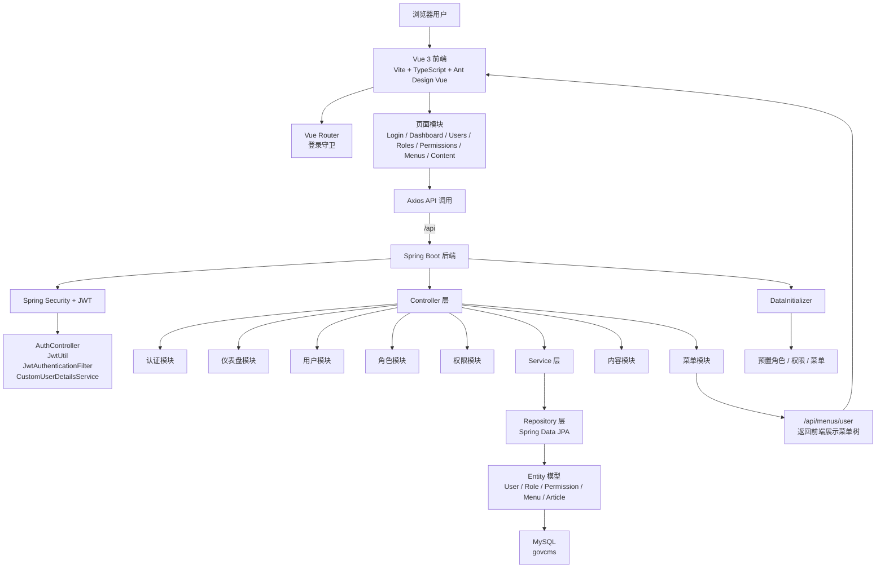

# Findings: GovCMS 当前实现研究

## 项目定位

当前仓库是一个 **前后端分离的 GovCMS 管理系统原型**，并非 Drupal/PHP 版 govCMS。

- 后端基于 Spring Boot 3.2 + Java 17
- 前端基于 Vue 3 + TypeScript + Vite
- 已落地模块聚焦在认证、RBAC、后台导航与内容管理基础能力
- 多租户、工作流、站点管理、媒体管理仍处于规划或待开发阶段

---

## 当前实际技术栈

### 后端
| 技术 | 当前实现 | 说明 |
|------|----------|------|
| 框架 | Spring Boot 3.2 | 主应用框架 |
| 语言 | Java 17 | 运行时版本 |
| 安全 | Spring Security + JWT | 登录认证与接口鉴权 |
| ORM | Spring Data JPA | 当前代码已落地 |
| 数据库 | MySQL | 默认库名 `govcms` |
| 构建 | Maven | `pom.xml` 管理依赖 |

### 前端
| 技术 | 当前实现 | 说明 |
|------|----------|------|
| 框架 | Vue 3 | 组合式 API |
| 语言 | TypeScript | 前端类型系统 |
| UI | Ant Design Vue | 后台管理界面组件库 |
| 路由 | Vue Router | 页面导航与登录守卫 |
| 请求 | Axios | 调用后端 API |
| 构建 | Vite | 本地开发与打包 |

---

## 代码库现状

### 已实现模块
- 认证登录：`/api/auth/login`
- 用户管理：用户列表、详情、增删改、改密、重置密码
- 角色管理：角色 CRUD 与权限分配
- 权限管理：权限树与权限 CRUD
- 菜单管理：菜单 CRUD 与前端动态导航
- 仪表盘：基础统计接口与页面
- 内容管理：文章 CRUD、发布、下线

### 已有工程能力
- JWT 鉴权链路
- 路由守卫与 Token 本地持久化
- Vite 开发代理到后端 `8080`
- 初始化权限、角色、菜单数据
- 全局异常处理

### 尚未落地模块
- 多租户数据隔离
- 审核工作流
- 站点管理
- 栏目管理
- 媒体管理
- 容器化与 CI/CD

---

## 模块关系图

---

## 关键业务链路

### 1. 登录认证链路
- 用户在前端登录页输入用户名和密码
- 前端调用 `/api/auth/login`
- 后端完成身份验证后签发 JWT
- 前端将 Token 存入 `localStorage`
- 路由守卫与后续 API 请求基于 Token 控制访问

### 2. 菜单导航链路
- `MainLayout.vue` 在登录后请求 `/api/menus/user`
- 后端 `MenuController -> MenuService` 组装菜单树
- 前端将返回结果转换为 Ant Design Menu 所需格式
- 当前文档已同步：登录后仅显示 Dashboard 的问题已修复

### 3. RBAC 权限链路
- 用户关联角色
- 角色关联权限
- Spring Security 根据接口所需权限控制访问
- 前端页面级访问已具备，按钮级权限控制仍待补齐

---

## 文档同步说明

本次同步重点修正了以下偏差：

- 先前文档中的 `Flowable`、`MyBatis-Plus`、`Redis`、`Pinia` 属于规划项，并未在当前代码中落地
- 当前实际后端 ORM 为 `Spring Data JPA`
- 当前实际前端状态管理主要依赖组件状态与本地存储，尚未引入 `Pinia`
- 已知的菜单导航问题已从待修复事项中移除

---

## 参考资料

- 需求分析：`requirement_analysis.json`
- 系统设计：`system_design.json`
- 进度记录：`progress.md`
- 任务规划：`task_plan.md`
- 权限设计：`permission_role_design.md`
